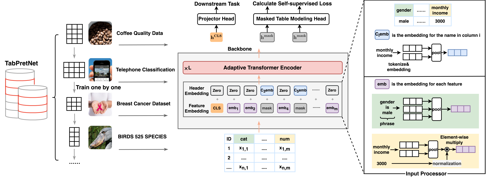

<div align="center">

</div>

<h3 align="center"> 
<a href="https://arxiv.org/abs/2307.04308"> Paper </a> | 
<a href="run.sh"> Example </a> |  
<a href="https://drive.google.com/file/d/1zDoH-trPMTGtkpefErozQMulgqioB9Y2/view"> 😀 Pre-trained Model </a> |
<a href="https://drive.google.com/file/d/1-2m1tyejUV5_bZduqZw1ZXS1BUSkhzVl/view?usp=drive_link"> 📕 Pre-training Dataset </a>
</h3>
</div>

This is the official Github repository for the paper "CT-BERT: Learning Better Tabular Representations Through Cross-Table Pre-training" by Chao Ye and Guoshan Lu, etc.

## Overview
Tabular data — also known as structured data — is one of the most common data forms in existence, thanks to the stable development
and scaled deployment of database systems in the last few decades. At present however, despite the blast brought by large pre-trained
models in other domains such as ChatGPT or SAM, how can we extract common knowledge across tables at a scale that may
eventually lead to generalizable representation for tabular data remains a full blank. In this project, we present **CT-BERT**, a generic and efcient cross-tablepre-training solution.  


## Code

The [run.sh](https://github.com/Chao-Ye/paperid-437/blob/main/run.sh) file demonstrates commands to perform supervised learning from scratch, fine-tuning, and cross-table pre-training with CT-BERT.

## Datasets

### Cross-table Pre-training Dataset (our TabPretNET) 

We have uploaded our pre-training corpus to to Google Cloud Drive. You can download it from [here](https://drive.google.com/file/d/1zDoH-trPMTGtkpefErozQMulgqioB9Y2/view) and use this [code](https://github.com/Chao-Ye/paperid-437/blob/main/CTBert/load_pretrain_data.py) to load all the datasets. We will soon be open-sourcing our cross-table pre-training models (CT-BERT-v1) and datasets (TabPretNET) on Huggingface.

### Downstream Task Datasets Source
Note that we are careful to guarantee that the tabular datasets used in pre-training and the downstream benchmark datasets are non-overlapping, so there is no data leakage issue.  
pc4  https://www.openml.org/d/1049   
kc1  https://www.openml.org/d/1067  
car  https://archive.ics.uci.edu/dataset/19/car+evaluation  
wilt  https://archive.ics.uci.edu/dataset/285/wilt  
higgs  https://www.openml.org/d/44422  
adult  https://archive.ics.uci.edu/dataset/2/adult  
climate  https://archive.ics.uci.edu/dataset/252/climate+model+simulation+crashes  
credit-g  https://archive.ics.uci.edu/dataset/144/statlog+german+credit+data  
vehicle  https://archive.ics.uci.edu/dataset/149/statlog+vehicle+silhouettes  
segment  http://archive.ics.uci.edu/dataset/50/image+segmentation  
amazon  https://www.openml.org/d/44712  
satimage  https://archive.ics.uci.edu/dataset/146/statlog+landsat+satellite  
phishing  https://archive.ics.uci.edu/dataset/327/phishing+websites  
mice-protein  https://archive.ics.uci.edu/dataset/342/mice+protein+expression  
cylinder-bands  https://archive.ics.uci.edu/dataset/32/cylinder+bands  

## Citation

If you use CT-BERT in your work, please cite our paper:

```bibtex
@misc{ye2023ctbert,
      title={CT-BERT: Learning Better Tabular Representations Through Cross-Table Pre-training}, 
      author={Chao Ye and Guoshan Lu and Haobo Wang and Liyao Li and Sai Wu and Gang Chen and Junbo Zhao},
      year={2023},
      eprint={2307.04308},
      archivePrefix={arXiv},
      primaryClass={cs.LG}
}
```


## Acknowledgement

- [Deepspeed](https://github.com/microsoft/DeepSpeed): We use the deepspeed framework to pre-train our models. We are very grateful for Microsoft's deepspeed framework to make large-scale pre training deployments possible.
